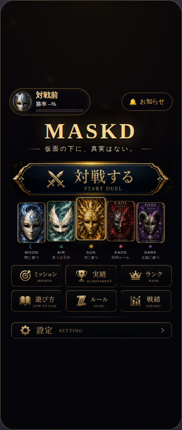

# MASKD

> **仮面の下に、真実はない。**
> 仮面舞踏会を舞台にした、心理戦・推理カードゲーム。相手の伏せた仮面を読み、駆け引きで得点を競う ― 1人用（vs CPU）・ブラウザですぐ遊べる。

<!-- スクリーンショットを置く場合は screenshots/ に入れてここで参照 -->
<!--  -->

## どんなゲーム？

- **相手のカードは伏せられている。** 数字は分かるが、属性（仮面）は隠されている。公開が進むほど候補が絞られ、**「看破」できれば読み勝ち**。
- **親と子の非対称な駆け引き。** 親が先に伏せて置き、子は数字を見てから置く。親だけが「決戦・撤退・入替」を選べる。
- **遊びながら少しずつ強くなる。** 最初は3色だけの**初級**からスタート。勝つと **AIR → KAOS** と新しい札が解放され、各レベルに**主（ライバル）**がいる。全部説明されてから始めるのではなく、**手を動かしながら覚える**設計。

## ルール（要点）

- 異属性（Moon/Dark/Sun）は**3すくみ＝じゃんけん**：月✊＞闇✌＞太陽✋＞月。数字は無関係。
- 同属性同士は**数字が大きい方**が勝ち。
- **AIR** が絡むと必ず引き分け（流れを止める札）。ただし **KAOS は数字問わず AIR に勝つ**。
- **KAOS** が絡む（AIRなし）→ 数字勝負。特殊ルール：**Kaos 0・1 は最強の5を食う** ／ Kaos 5 は 1 に負ける。
- **最終ラウンドの決戦は得点2倍**（どのレベルでも山場になる）。
- 最終得点 ＝ 決戦の得点 ＋ 残り戦略カウンター ＋ 残り手札ボーナス ＋ 仮面あて（読み）ボーナス。

## 特徴

- 🎭 **仮面あて（読み）ボーナス**：相手の伏せ札の属性をワンタップで予想。的中でボーナス点。看板の「読み合い」を能動的な一手に。
- 🃏 **段階的に解放されるルール**：初級（3色）→ 中級（＋AIR）→ 上級（＋KAOS）→ 本戦（入替・奇襲・終盤2倍・全ルール）。
- 👑 **レベルの主（ライバル）と称号**：各レベルに専用AIのライバル（三色の道化アルル／風唄いのゼファ／仮面卿ノクス）。★クリア目標を集め、称号をアンロックして装備。
- 🤖 **手応えのあるCPU**：3つの性格 × 3段階の強さ。本物の判定を移植したシミュレータで勝率を検証しながら調整。
- ✨ **演出・効果音**：3Dめくり・決着のインパクト・KAOS/AIRの発動演出・WebAudio合成SFX。`prefers-reduced-motion` 配慮。
- 🎴 **2つのカード表示**：初心者向け（じゃんけん記号・数字・属性名）／上級者向け（リッチな仮面イラスト）。
- 📱 **PWA対応**：スマホの「ホーム画面に追加」でアプリのように起動。

## 遊ぶ

ブラウザだけでそのまま遊べます（GitHub Pages で公開）。
スマホでは「ホーム画面に追加」でアプリのように起動できます。

ルールの全文・変更履歴はアプリ内（ヘッダーの「MASKD」タップ）から確認できます。

## 開発ステータス

**v1.0 に向けて仕上げ中。** ルール／CPU／実績・統計／PWA／演出は実装済みで、現在は**初回体験（オンボーディング）の磨き込み**と**ユーザーテストのための計測**を整備している段階。今後は少人数のテストプレイで得たデータを根拠に改善していく方針。詳細は [TODO.md](TODO.md) を参照。
